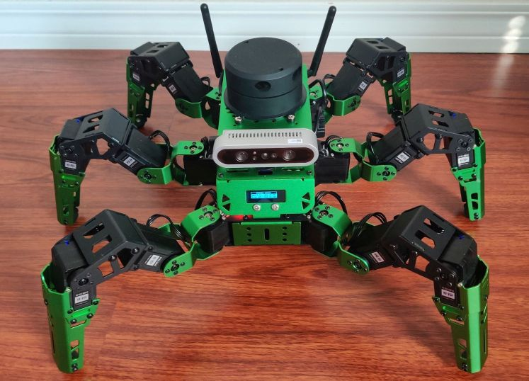
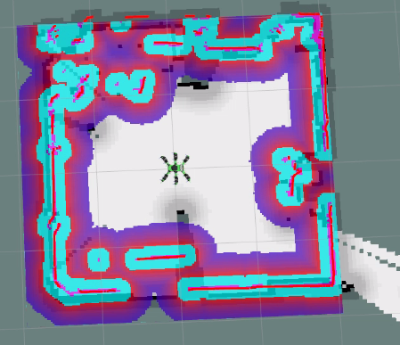

=====================================================
Autonomous Vehicles: Investigating Hiwonder's JetHexa
=====================================================

**Videos**:

    - `Learning the JetHexa <https://youtu.be/Me6y4_BrutE>`_
    - `Showcasing JetHexa's Autonomous Navigation <https://youtu.be/s7YwTT8dACg>`_
    - `Showcasing JetHexa's Obstacle Avoidance <https://youtu.be/i8jWWjjloLw>`_

**Reports**: Download the :download:`concetenated reports <_static/pdfs/jethexa_reports.pdf>`.

**Robot(s) Used**:

- JetHexa (Hiwonder)

Synopsis
========

This project was more investigative. The purpose was to become acclimated with a more advanced robot platform, learning its motion capabilities, gaits, computer vision applications, autonomous navigation and more. The invesitgative work done in this project served me well in completing two important projects further down the line: the :doc:`Tennis Ball Detector <tennis>` and my :doc:`Master's Thesis <uavfollower>`. 

In all, this project served to further my understanding regarding:

- ROS (Robot Operating System)
- Autonomous Path Planning and Obstacle Detection
- Navigating a large codebase
- Quickly gaining familiarity with new systems

The JetHexa
===========

I moved from the Lynxmotion robot arm in the :doc:`previous project <lynxbot>` to a fully-fledged autonomous hexapod robot: Hiwonder's JetHexa. This robot is controlled by the NVIDIA Jetson Nano, a powerful minicomputer with GPU that enables timely performance of computationally-expensive operations. Running an Ubuntu 18.04 LTS Linux distribution, the robot is able to run the Robot Operating System (ROS), specifically the Melodic distribution. ROS enables users to extend the capabilities of their robots by constructing and composing a variety of user-defined packages. This project marked my first time using the ROS architecture.

In addition to the software components, the JetHexa possesses hardware such as lidar, RGB camera, depth camera, odometry sensors, and more. These sensors enable the use of advanced navigation techniques like Simultaneous Localization and Mapping (SLAM). In conjunction with the software, the user is able to create maps of a given real-world operating environment and command the robot to traverse the environment by defining click-based waypoints.

    Environment mapping and obstacle detection using the JetHexa (displayed in RViz).