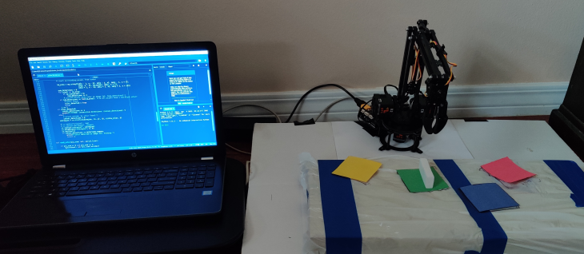

==================================================
Lynxbot: A Color-controlled 3DoF Robot Manipulator
==================================================

**Videos**:

    - `Robot Arm Assembly <https://youtu.be/SLJi2BDQgF8>`_ 
    - `Color Detection; FK/IK Derivation <https://youtu.be/Yv9HVnBBRVE>`_ 
    - `Pick-and-Place; Arduino-Python Communication <https://youtu.be/jHznnVcfGLA>`_ 

**Reports**: Download the :download:`concatenated reports <_static/pdfs/lynxbot_reports.pdf>`.

**Code** [disclaimer]_ : View the project repository `on GitHub <https://github.com/tjdwill/
Lynxbot>`_.

**Robot(s) Used**:

- Lynxmotion SES-V2 3DoF Robot Arm

Synopsis
============

My first robotics project, the purpose of this work was to assemble the Lynxmotion SES-V2 Robot Arm (3DoF) and use it to implement a color-based pick-and-place operation. In the process, I improved my understanding of:

- Robot Assembly
- Interfacing with servos
- Basic color detection
- Forward and Inverse Kinematics Derivation and Implementation
- Serial communication 
- Project management

.. rubric:: Footnotes

.. [disclaimer] Disclaimer: I have made considerable improvements in programming ability since this project 🙂.