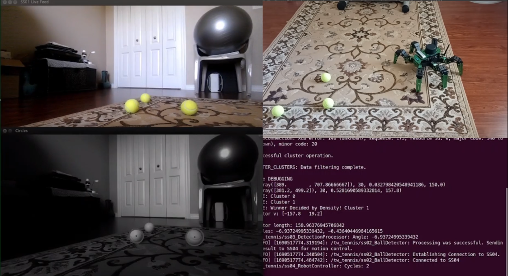
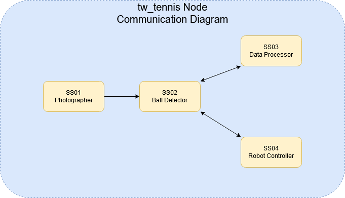

====================
Tennis Ball Detector
====================

**Videos**:

    - `Implementing Tennis Ball Detection <https://youtu.be/LeLQ7bqcsco>`_
    - `Developing the ROS Packages <https://youtu.be/au4tLTOkUE0>`_
 
**Reports**: Download the :download:`concatenated reports <_static/pdfs/tennis_reports.pdf>`.

**Code**: View the code repository `on GitHub <https://github.com/tjdwill/TennisBallDetector>`_.

**Robot(s) Used**:

- JetHexa (Hiwonder)

Synopsis
========

In this project, I utilized computer vision, k-means clustering, and data
filtering techniques to identify tennis balls and face the closest one.
This project was developed on Hiwonder's JetHexa platform and marks both my
first ROS project and my first foray into developing OOP-style classes.

Through the completion of this project, I learned:

- ROS Package Development
- Object-Oriented Programming Concepts (ex. encapsulation, message passing, etc.)
- Multi-system Design
- Basic Computer Vision
- K-Means Clustering [#kmeans_repo]_
- Data filtering techniques (ex. use of discrete-derivatives for density estimation)

This project is also the ancestor to my :doc:`Master's Thesis <uavfollower>`, and was a platform for immense growth as a software engineer, a roboticist, and a project manager.

    The basic communication structure of the tennis ball detection program.

.. [#kmeans_repo] This project was the birth of what eventually became my first Python package, `kmeans <https://github.com/tjdwill/kmeans>`_. 